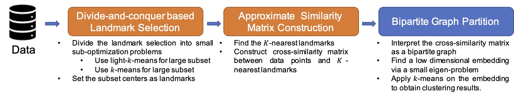
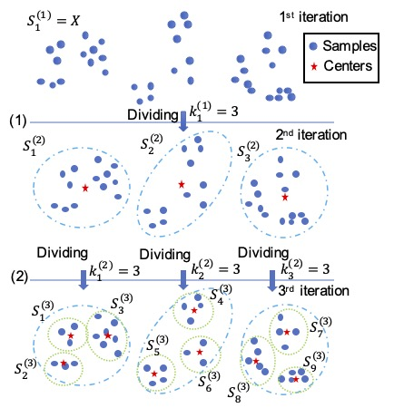
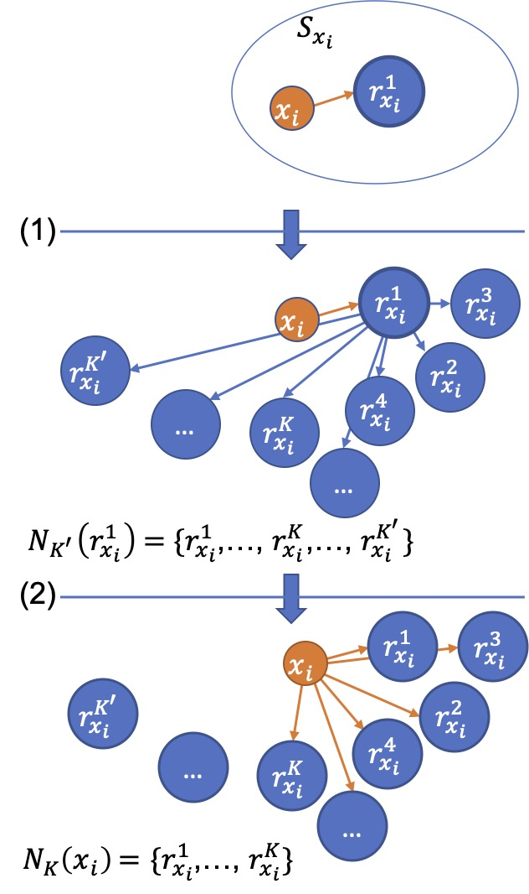

# Divide-and-conquer based Large-Scale Spectral Clustering

**Published in:** Neurocomputing, Volume 501, Pages 664-678, 2022
**DOI:** https://doi.org/10.1016/j.neucom.2022.06.006

You can also find our paper in [ArXiv.org](https://arxiv.org/abs/2104.15042) Or [ResearchGate](http://dx.doi.org/10.13140/RG.2.2.15207.37281).

## Datasets
Five real world datasets and five synthetic datasets:

### Available in Repository (via Git LFS)
- PenDigits (137KB)
- USPS (14MB)
- Letters (163KB)
- MNIST (14MB)
- Covertype (6.4MB)
- Two Moons-1M / TM-1M (15MB)
- Three Spirals-60K / TM-60K (8.6MB)

### Large Datasets (Download Separately)
Due to GitHub's file size limitations, the following large datasets need to be downloaded separately:

- **Three Circles-6M (TC-6M)** - 86MB
  - [Download from Google Drive](https://drive.google.com/file/d/YOUR_FILE_ID_HERE)
  - [Download from Dropbox](https://www.dropbox.com/s/YOUR_FILE_ID_HERE)

- **Circles and Gaussian-10M (CG-10M)** - ~200MB+
  - [Download from Google Drive](https://drive.google.com/file/d/YOUR_FILE_ID_HERE)
  - [Download from Dropbox](https://www.dropbox.com/s/YOUR_FILE_ID_HERE)

- **Flower-20M (FL-20M)** - 321MB
  - [Download from Google Drive](https://drive.google.com/file/d/YOUR_FILE_ID_HERE)
  - [Download from Dropbox](https://www.dropbox.com/s/YOUR_FILE_ID_HERE)

After downloading, place these files in the `Datasets/` folder.

### Dataset Format
All datasets are stored in MATLAB `.mat` format with the following structure:
- `X`: Feature matrix (n × d)
- `Y`: Label vector (n × 1)

## Algorithm


- [Divide-and-conquer based Large-scale Spectral Clustering](DnC_SC.m)




- [Divide-and-conquer based Landmark Selection](DnC_landmark)
    
    <!-- - [light-k-means](figs) -->
- Approximate K-nearest landmarks method (line 35~62 of [DnC_SC](DnC_SC.m))
    

## Code

See our [demo](demo.m).

# Reference
If you find this code useful for your research, please cite
```
@article{li2022divideandconquer,
    title={Divide-and-conquer based large-scale spectral clustering},
    author={Hongmin Li and Xiucai Ye and Akira Imakura and Tetsuya Sakurai},
    journal={Neurocomputing},
    volume={501},
    pages={664--678},
    year={2022},
    publisher={Elsevier},
    doi={10.1016/j.neucom.2022.06.006}
}
```

ArXiv preprint citation:
```
@misc{li2021divideandconquer,
    title={Divide-and-conquer based Large-Scale Spectral Clustering},
    author={Hongmin Li and Xiucai Ye and Akira Imakura and Tetsuya Sakurai},
    year={2021},
    eprint={2104.15042},
    archivePrefix={arXiv},
    primaryClass={cs.LG}
}
```
